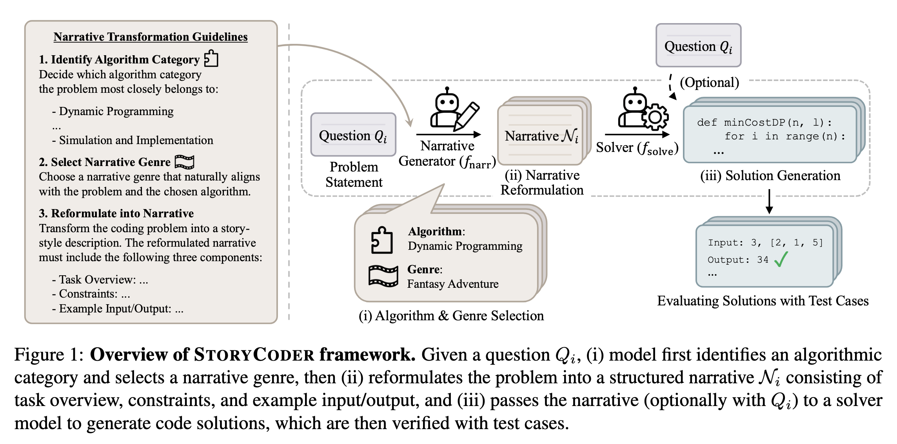

# StoryCoder: Narrative Reformulation for Structured Reasoning in LLM Code Generation

## Overview

**StoryCoder** is a narrative reformulation framework that transforms code generation problems into coherent natural language narratives, guiding LLMs toward more structured reasoning and better algorithmic strategies.

Existing approaches augment reasoning steps or inject specific structure into how models think, but leave scattered problem conditions unchanged. StoryCoder addresses this by reorganizing task representation itself: converting fragmented, instruction-like problem statements into structured narratives that provide richer contextual structure than simple rephrasings.

Each narrative consists of three deliberate components, guided by the selected algorithm and genre:

- **Task Overview**: Presents the coding objective within a narrative frame, integrating scattered conditions into a coherent system.
- **Constraints**: Reframes input ranges, time limits, and rules as natural restrictions in the story.
- **Example Input/Output**: Integrates sample test cases into contextual scenarios, preserving formal coding task requirements within the narrative space.

<p align="center">
  
</p>

## Repository Structure

```plaintext
StoryCoder/
├── convert_to_narrative.py       # Step 1: Generate narratives from coding problems
├── narrative_splitter.py         # Step 2: Split variants into per-variant JSONL files
├── instruction_template.py       # Prompt template for narrative conversion
├── data/                         # Input JSONL files (benchmark problems)
└── outputs/                      # Generated narrative JSONL files
```

## Installation

```bash
pip install google-genai openai anthropic
```

API keys are read from environment variables:

```bash
export OPENAI_API_KEY=...
export ANTHROPIC_API_KEY=...
export GOOGLE_PROJECT_ID=...
export GOOGLE_LOCATION=...
```

## Usage

### Step 1: Generate Narratives

Convert coding problems into narrative format using one of three supported backends: `gemini`, `chatgpt`, or `claude`.

```bash
python convert_to_narrative.py \
    --backend gemini \
    --input data/livecodebench_v6.jsonl \
    --output outputs/livecodebench_v6_narratives.jsonl \
    --n_variants 5
```

**Arguments:**

| Argument | Description | Default |
|---|---|---|
| `--backend` | LLM backend (`gemini`, `chatgpt`, `claude`) | required |
| `--input` | Path to input JSONL file | required |
| `--output` | Path to output JSONL file | required |
| `--n_variants` | Number of narrative variants per problem | `5` |

### Input Format

Each line of the input JSONL file should contain a problem with at least the following fields:

```json
{
  "question_id": "unique_id",
  "question_content": "Problem statement here..."
}
```

### Output Format

The output JSONL file appends a `narratives` field to each problem:

```json
{
  "question_id": "unique_id",
  "question_content": "...",
  "narratives": [
    "- Algorithm Category: Dynamic Programming\n- Narrative Genre: Fantasy Adventure\n- Task Overview: ...",
    "..."
  ]
}
```

### Step 2: Split Narratives into Per-Variant Files

Split the multi-variant output from Step 1 into individual JSONL files — one per narrative variant. Each output file replaces `question_content` with the narrative text (with the Algorithm Category and Narrative Genre headers stripped), making it directly compatible with the LiveCodeBench evaluation pipeline.

```bash
python narrative_splitter.py \
    --input outputs/livecodebench_v6_narratives.jsonl \
    --output_dir outputs/split/
```

This produces `N` files named `livecodebench_v6_narratives_narrative_1.jsonl` through `livecodebench_v6_narratives_narrative_N.jsonl` in the specified output directory.

### Step 3: Evaluate with LiveCodeBench

Each per-variant JSONL file produced in Step 2 can be used directly as the input dataset for [LiveCodeBench](https://github.com/LiveCodeBench/LiveCodeBench) evaluation. Pass the narrative JSONL file wherever LiveCodeBench expects a benchmark dataset file — no other changes to the evaluation pipeline are needed.